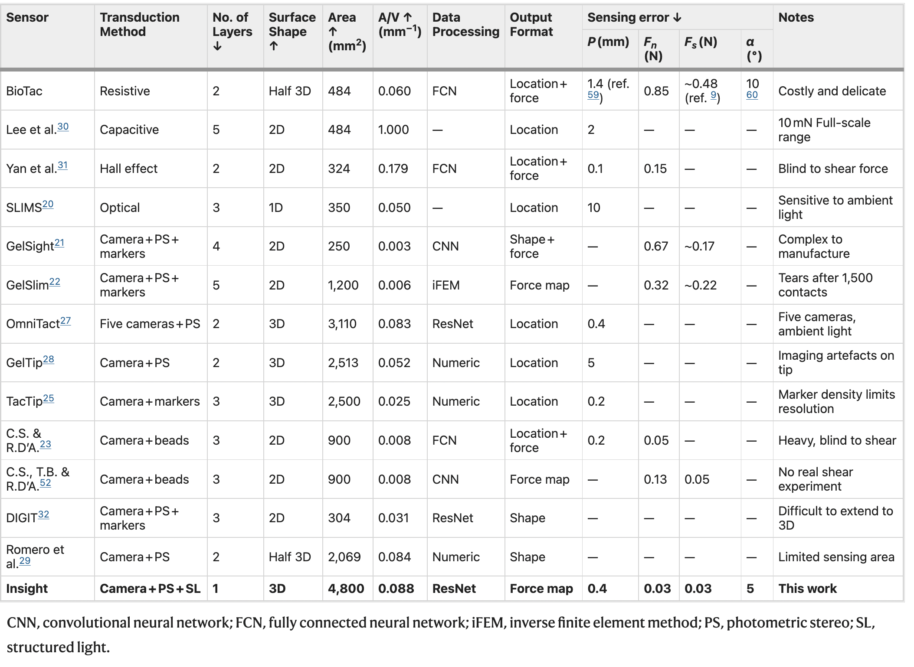

# awesome-tactile-sensing
>Collection of vision-based tactile sensing papers and blogposts

---------------------------------------

# 1 Survey papers
**[0]** Bengio, Yoshua, Ian J. Goodfellow, and Aaron Courville. "**Deep learning**." An MIT Press book. (2015). [[html]](http://www.deeplearningbook.org/) **(Deep Learning Bible, you can read this book while reading following papers.)** :star::star::star::star::star:  

Overview of sensors in this table from the paper [A soft thumb-sized vision-based sensor with accurate all-round force perception](https://www.nature.com/articles/s42256-021-00439-3/tables/1):  

# 2 Sensor design papers and related github repositories
## 2.1 Gelsight and its variants
## 2.2 DIGIT
## 2.3 FingerVision
## 2.4 ETH Zurich tactile sensor
## 2.5 GelTip
## 2.6 DelTact
## 2.7 OmniTact
## 2.8 TacTip
## 2.9 Insight
# 3 Tactile sensing tasks
## 3.1 Touch Detection
## 3.2 Force Estimation
## 3.3 Pose Estimation
## 3.4 3D reconstruction
## 3.5 Slip detection
